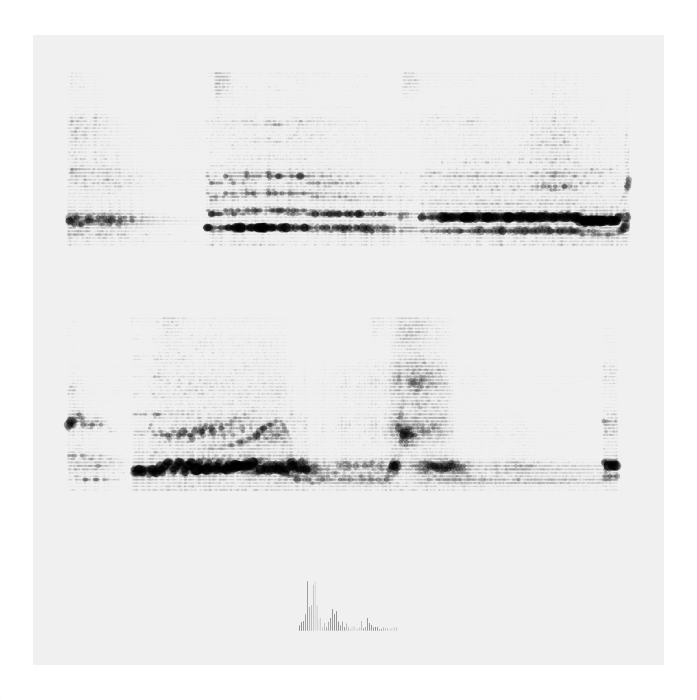

# spectrogram-ish

uses [Processing](https://processing.org) to visualize sound, perhaps for live performance. As sound is picked up on your computer's microphone, this sketch produces two rows of spectrogram-like marks before the slate is cleared to start again. You can think of this as a paint brush that uses different bands of the audio spectrum as hairs or bristles.

There's one folder in this project:
- `spectrogram`, which contains the code used to make the visualization above

# Installation

1. Copy `spectrogram` into your processing sketches folder. On a mac, this is typically `~/Documents/Processing`
2. Open `spectrogram` in Processing.
3. Now make some sounds (like talking, yelling, singing) and see things appear and change on screen.

Thanks for your kind attention!
